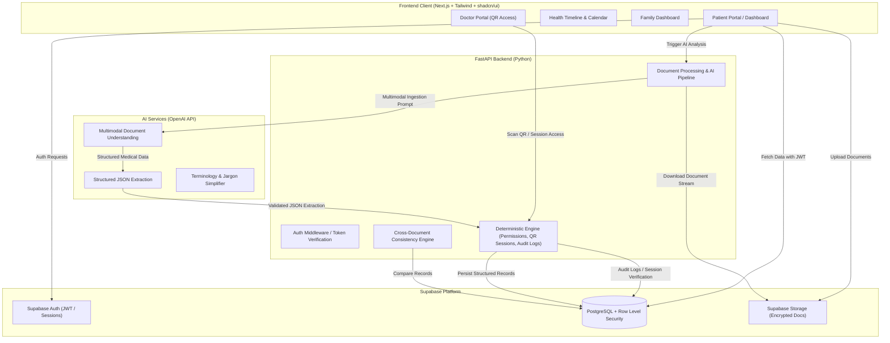

# CarePath — Architecture Documentation

**CarePath: Unified Intelligent Healthcare Journey**  
A patient-owned healthcare platform that converts fragmented medical documents (prescriptions, laboratory reports, clinical notes, and medical PDFs/images) into a structured, chronological, and understandable health journey.

---

## 1. Project Purpose & Vision

Modern healthcare interactions produce fragmented, heterogeneous records stored across silos: printed prescriptions, PDF lab reports, hospital discharge summaries, imaging results, and handwritten doctor notes. Patients struggle to assemble these records into a cohesive medical history, navigate complex terminology, detect potential discrepancies, or securely share records with doctors.

**CarePath** solves this by empowering patients to:
1. **Centralize & Own Records**: Ingest, organize, and store medical documents securely in a patient-owned vault.
2. **Understand Medical Information**: Extract clinical entities into structured formats with patient-friendly terminology explanations and direct links to source documents.
3. **Visualize Health Chronology**: Generate a unified timeline and an AI-derived health calendar (distinguishing confirmed dates from inferred dates).
4. **Detect Discrepancies Safely**: Perform cross-document consistency checks with responsible phrasing (*"Potential Information Mismatch — Verify against original source"*).
5. **Manage Family Health**: Maintain separate health records and permissions across family members.
6. **Share Securely**: Grant temporary, consent-controlled doctor access via time-bound QR sessions and audit-logged doctor portals.

---

## 2. Technology Stack

| Layer | Technologies | Role / Justification |
| :--- | :--- | :--- |
| **Frontend** | Next.js (App Router), TypeScript, Tailwind CSS, shadcn/ui, Lucide Icons | Server and client component rendering, type-safe UI, responsive design system, accessible healthcare UX. |
| **Backend API** | FastAPI, Python | High-performance asynchronous API, deterministic business logic, data validation (Pydantic), orchestrating AI pipelines. |
| **Database & Auth** | Supabase (PostgreSQL), Supabase Auth, Row Level Security (RLS) | Relational medical data storage, relational integrity, row-level tenant isolation, JWT authentication. |
| **Storage** | Supabase Storage | Encrypted, bucket-based medical document and asset storage with signed access URLs. |
| **AI & Document Intelligence** | OpenAI & Google Gemini (Fallback) | Multimodal document comprehension, strict structured JSON extraction, controlled fallback on 429 quota exhaustion. |
| **Payments & Monetization** | Razorpay (Sandbox) | Tiered subscriptions (Free vs Premium), HMAC-SHA256 signature verification, server-side AI quota enforcement. |
| **Version Control & Dev** | Git, GitHub, Antigravity | Version control, branch workflows, and AI pair programming platform. |

---

## 3. High-Level Architecture & Data Flow

---

## 4. Architectural Rules & Guardrails

To ensure clinical safety, data integrity, and strict patient privacy, the CarePath architecture adheres to these non-negotiable rules:

1. **No Custom ML/OCR Models**: Do not build or train custom ML or OCR models. Rely on industry-standard multimodal vision models (OpenAI API) for document understanding.
2. **No Unnecessary Dependencies**: Keep the architecture lean. Do not substitute Supabase with MongoDB or Firebase, nor replace FastAPI.
3. **Deterministic Security and Business Logic**:
   - **Never** allow an LLM to control authentication, authorization, or user permissions.
   - Authentication, authorization, database operations, date calculations, consent verification, QR sessions, access expiration, and audit logs **must be strictly deterministic** code running on the FastAPI backend or enforced by PostgreSQL RLS.
4. **Source Traceability**: Every AI-extracted clinical entity (medication, dosage, diagnosis, lab value) must retain a verifiable citation pointing to the source document ID, page, or bounding context.
5. **Date Clarification**: AI-derived or inferred dates must always be explicitly tagged and distinguished in the schema from confirmed dates recorded on official documents.
6. **Responsible Discrepancy Language**: Never label an AI-detected inconsistency as a "confirmed medical error" or "malpractice". Use cautious, objective phrasing:
   > *"Potential Information Mismatch — Verify against original source."*
7. **Family Health Isolation**: Family members within a household account must possess distinct patient record IDs, health profiles, and discrete access controls.
8. **QR Access Ephemerality**: QR codes represent temporary, time-bounded session tokens. Authorization validation and expiration checks are executed server-side; QR tokens carry zero permanent privilege.
9. **Credential Protection**: Secret API keys (OpenAI, Supabase service roles) are stored server-side and never exposed to the client bundle.
10. **Evidence-Based Medical Outputs**: No generation of synthetic medical statistics or speculative clinical advice.

---

## 5. Technology Responsibilities

### 5.1 Next.js Frontend
- Presentation layer for Patient, Family, and Doctor interfaces.
- Client-side navigation, responsive layout, accessible UI primitives via shadcn/ui.
- Document upload previews, interactive timeline rendering, and source document inspection viewers.
- Zero business logic authorization; relies on Supabase Auth tokens and verified backend responses.

### 5.2 FastAPI Backend
- Ingestion and processing pipeline orchestrator.
- Secure communication with OpenAI API using validated Pydantic schemas.
- Enforcement of session lifetimes, QR generation and redemption, consent management.
- Audit logging of all access requests (including doctor read access).
- Deterministic cross-document consistency algorithms.

### 5.3 Supabase (PostgreSQL, Auth, Storage)
- **Supabase Auth**: Issue and verify JWTs, email/password or OAuth authentication flows.
- **PostgreSQL**: Relational storage for users, patient profiles, family links, documents, structured clinical records, timeline events, doctor sessions, and audit trails.
- **Row Level Security (RLS)**: Enforces that patients can only select, insert, update, or delete records belonging to their authenticated `user_id` or explicitly delegated family members.
- **Storage**: Secure object storage for medical PDFs and images with restricted access policies.

### 5.4 OpenAI API
- Multimodal analysis of unstructured prescription slips, handwritten notes, and PDF lab reports.
- Extraction into well-defined JSON schemas conforming to clinical taxonomy.
- Generation of layman-friendly explanations for complex medical terms, linked to extracted entities.

---

## 6. Streamlined Implementation Roadmap & Development Sprints

The implementation strategy consolidates related architectural milestones into controlled development sprints:

| Sprint | Encompassed Phases | Focus & Milestones | Status |
| :---: | :--- | :--- | :---: |
| **Sprint 1** | **Phases 1 + 2** | **Foundation, Auth & Patient Profile** Next.js 16 scaffolding, Supabase Auth, SSR cookie sync, route proxy protection, `public.patients` table, RLS, patient onboarding. | **Complete & Verified** |
| **Sprint 2** | **Phases 3 + 4 + 5** | **Data Foundation + Dashboard + Document Vault** `public.documents` table with CHECK constraints, private storage bucket `medical-documents`, storage RLS, Document Vault UI (`/documents`), file validation, time-bound signed URLs, live patient command center (`/dashboard`). | **Complete & Verified** |
| **Sprint 3** | **Phases 6 + 7 + 8** | **FastAPI Ingestion & AI Clinical Extraction** FastAPI Python backend, OpenAI multimodal document analysis, validated Pydantic schemas, normalization of medications, conditions, and lab values. | **Complete & Verified** |
| **Sprint 4** | **Phases 9 + 10 + 11 + 12** | **Unified Health Journey Intelligence** Chronological visual timeline (`/timeline`), AI health calendar (`/calendar`), deterministic date projection vs confirmed dates, bidirectional source linking with page-level PDF inspection, cross-document information mismatch engine. | **Complete & Verified** |
| **Sprint 5** | **Phases 13 + 14 + 15 + 16 + 17** | **Doctor Access, Family Management & Final Polish** Time-bound QR consent sessions, read-only clinician portal, multi-dependent family vaults, end-to-end security audit, and synthetic datasets. | **Complete & Verified** |
| **Sprint 6** | **Phase 18 + AI Resiliency & Subscriptions** | **AI Fallback, Freemium Subscriptions, UI Polish & Final E2E** OpenAI/Gemini controlled fallback on 429 quota exhaustion, Razorpay sandbox checkout & HMAC verification, server-side monthly AI usage limits, Eleanor Vance dataset & clean demo isolation, 16/16 Next.js routes, 20/20 backend tests. | **Complete & Accepted** |

> **Architecture Status:** FROZEN. v1.0 Production Demo Ready. Zero major architectural revisions or new dependencies permitted.

